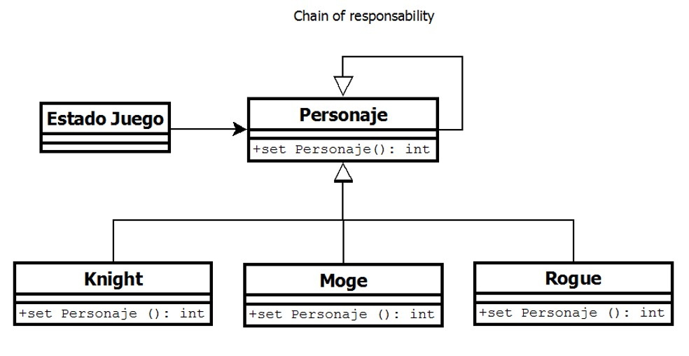
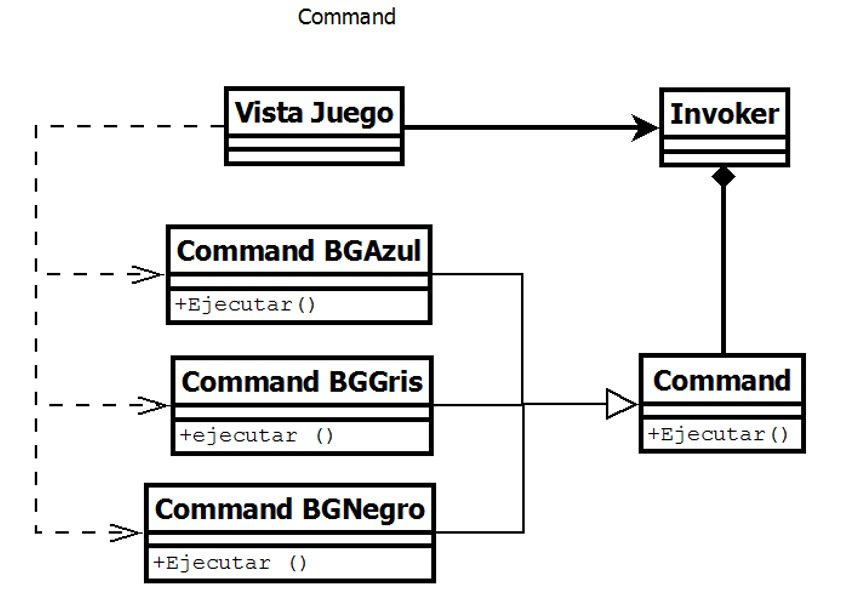
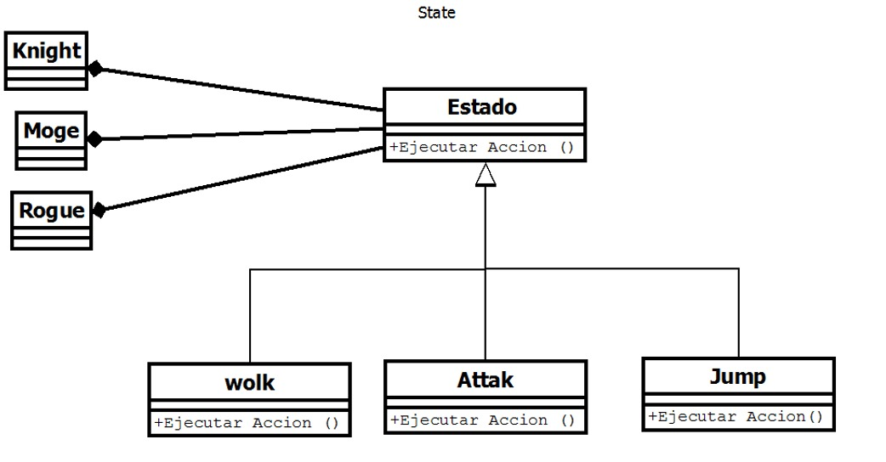
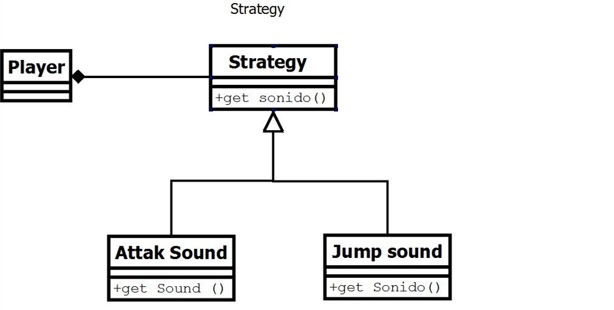
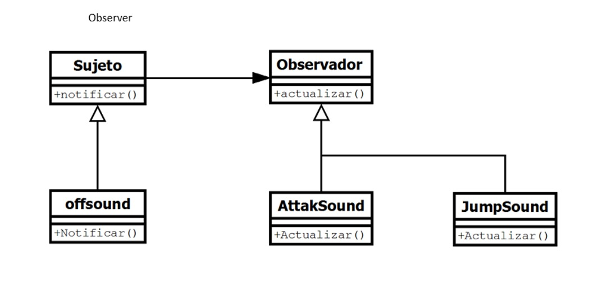

Proyecto Final - Modelos de Programación I

Integrantes:
- Nicolás Buitrago  20172020079 
- Diego Galeano     20172020074
- Diego Lizarazo    20172020093

Diagrama de Clases:

- Chain of Responsability

- Command

- State

- Strategy

- Observer

